# การศึกษาผลกระทบจากเหตุการณ์วิกฤตและความความขัดแย้งระหว่างประเทศส่งผลต่อความผันผวนของราคาน้ำมันสู่การปรับราคาตั๋วเครื่องบิน (ปี 2019 – 2026)

[](https://www.python.org/)
[](https://pandas.pydata.org/)
[](https://matplotlib.org/)
[](https://seaborn.pydata.org/)
[-orange.svg)]()
[]()

> **การศึกษาเชิงประจักษ์ด้านวิทยาการข้อมูล (Empirical Data Science) เพื่อวิเคราะห์การส่งผ่านผลกระทบของเหตุการณ์วิกฤตและความผันผวนของตลาดน้ำมันไปยังราคาตั๋วเครื่องบิน ค่าธรรมเนียมเชื้อเพลิง (Fuel Surcharges) อัตราการส่งผ่าน (Pass-Through Rates) ระยะเวลาส่งผ่าน (Transmission Lags) กำไรสายการบิน กลยุทธ์การประกันความเสี่ยงน้ำมัน (Fuel Hedging) และต้นทุนการบินอ้อมวิกฤตทางอากาศ**

---

## Executive Summary

น้ำมันเชื้อเพลิงอากาศยาน (Jet Fuel) เป็นหนึ่งในต้นทุนดำเนินงานหลักที่มีความผันผวนสูงที่สุดของสายการบินทั่วโลก โดยมีสัดส่วนสูงถึง **25% ถึง 40% ของค่าใช้จ่ายในการดำเนินงาน (OpEx)** เมื่อเกิดเหตุวิกฤตหรือความขัดแย้งระหว่างประเทศที่กระทบต่ออุปทานน้ำมันดิบโลก ราคาตั๋วเครื่องบินจะถูกปรับเปลี่ยนอย่างรวดเร็วผ่านการคำนวณราคาตั๋วพื้นฐาน (Base Fare) และค่าธรรมเนียมน้ำมันเชื้อเพลิง (Fuel Surcharges)

โครงการนี้ทำการวิเคราะห์ข้อมูลอนุกรมเวลาความยาว **90 เดือน (มกราคม 2019 – มิถุนายน 2026)** ครอบคลุม **เหตุการณ์ความขัดแย้งภูมิรัฐศาสตร์หลัก 4 วิกฤต**, **ระเบียนราคาตั๋วเครื่องบิน 14,850 รายการจาก 33 สายการบินทั่วโลก**, **ระเบียนค่าธรรมเนียมน้ำมัน 10,440 รายการ**, **ตัวชี้วัดทางการเงินสายการบิน 725 รายการ** และ **ข้อมูลผลกระทบการบินอ้อมเส้นทาง 3,240 รายการ**

### 🌟 สรุปผลลัพธ์สำคัญ (Key Findings)
1. **ความเร็วในการส่งผ่านราคา จากราคาน้ำมันสู่ราคาตั๋วเครื่องบิน (ระยะเวลาส่งผ่าน 0–1 เดือน):** การวิเคราะห์ความสัมพันธ์ไขว้ (Cross-Correlation) ทางสถิติพบว่า ราคาตั๋วเครื่องบินตอบสนองต่อการเปลี่ยนแปลงราคาน้ำมันดิบโดยแทบไม่มีระยะเวลารอคอย **(Lag 0 เดือน, $r = +0.400, p < 0.001$)** โดยค่าธรรมเนียมน้ำมัน (Fuel Surcharges) ช่วยให้สายการบินส่งผ่านต้นทุนได้อย่างรวดเร็วก่อนการปรับราคาตั๋วพื้นฐานรายไตรมาส
2. **การส่งผ่านผลกระทบในสภาวะวิกฤต (Amplified Pass-Through):**
   - **สงครามรัสเซีย-ยูเครน (2022):** ราคาน้ำมันพุ่งขึ้น +$74.8/บาร์เรล แตะระดับสูงสุดที่ $117.6/บาร์เรล ส่งผลให้ราคาตั๋วเครื่องบินเพิ่มขึ้นสูงสุด +$34.5 (อัตราส่งผ่าน $PT = 0.460$)( $PT = Pass-Through-Rate$)
   - **วิกฤตสงครามสหรัฐฯ-อิหร่าน (2025–2026):** การปิดล้อมช่องแคบฮอร์มุซทำให้ราคาน้ำมันดิบ Brent พุ่งทะยาน +$82.6/บาร์เรล (แตะระดับสูงสุดที่ $169.1/บาร์เรล) ราคาตั๋วเครื่องบินพุ่งขึ้น +$154.4 สร้างอัตราการส่งผ่านราคาทำสถิติสูงสุดเป็นประวัติการณ์ที่ **$PT = 1.869$**
3. **ความแตกต่างตามโมเดลธุรกิจ (Business Model Heterogeneity):** **สายการบินบริการเต็มรูปแบบ (Full-Service Carriers: FSC)** สามารถส่งผ่านต้นทุนน้ำมันไปยังผู้โดยสารได้รวดเร็วและรุนแรงกว่าผ่านค่าธรรมเนียมน้ำมันมาตรฐาน ทำให้รักษาอัตรากำไรได้ดีกว่า **สายการบินต้นทุนต่ำ (Low-Cost Carriers: LCC)** ซึ่งต้องแบกรับภาระต้นทุนเนื่องจากความอ่อนไหวต่อราคาของผู้โดยสารในเส้นทางระยะสั้น
4. **เกราะป้องกันและผลของการประกันราคาน้ำมัน (Figure 8-9 : Business1):** ผลประโยชน์จากการประกันความเสี่ยงราคาน้ำมัน (Fuel Hedging) พุ่งขึ้นสูงสุดในไตรมาส 1 ปี 2026 โดยช่วยประหยัดค่าน้ำมันได้ถึง **25.3% ของค่าใช้จ่ายน้ำมันรวม** ช่วยสร้างอัตรากำไรสุทธิเพิ่มขึ้นสูงสุด **+8.1 percentage points** อย่างไรก็ตาม อัตราการทำประกันราคาน้ำมันรายสายการบินไม่มีความสัมพันธ์กับอัตราผลกำไรจริง แม้การทำประกันราคาน้ำมันช่วยลดต้นทุนของอุตสาหกรรมในภาพรวม แต่ไม่ได้เป็นตัวตัดสินผลกำไรสุทธิ
5. **ภาระต้นทุนจากการปิดล้อมช่องแคบฮอร์มุซ (Figure 10-11 : Business2):** ภาระรวมจากวิกฤตทางอากาศช่องแคบฮอร์มุซสูงถึง **12.6 ล้านดอลลาร์สหรัฐ** โดย **95%** เกิดจากการสูญเสียรายได้จากการยกเลิกเที่ยวบิน และมีเพียง **5%** เท่านั้นที่เป็นค่าน้ำมันบินอ้อมเส้นทาง
6. **ราคาน้ำมันดิบ(Brent), จุดคุ้มทุนและการอยู่รอดของสายการบิน (Figure 12 : Business3):** ราคาน้ำมันดิบ(Brent), จุดคุ้มทุน (Break-Even Brent) ของสายการบินอยู่ระหว่าง **$107 ถึง $144/บาร์เรล** (ค่ามัธยฐาน **$115/บาร์เรล**) การทำประกันราคาน้ำมันช่วยเพิ่มส่วนเผื่อราคาน้ำมัน (Headroom) มัธยฐาน +$12.8/บาร์เรล ณ ระดับราคา Brent ไตรมาส 1 ปี 2026 ($130.9/บาร์เรล) มีเพียง **4 จาก 25 สายการบิน** เท่านั้นที่ยังคงมีกำไรเหนือจุดคุ้มทุน

---

## สารบัญ (Table of Contents)

- [คำถามวิจัย (Research Questions)](#research-questions)
- [ตารางสรุปเปรียบเทียบเหตุการณ์วิกฤต (Comparative Shock Summary)](#comparative-shock-summary)
- [รูปภาพและบทวิเคราะห์เชิงลึก (Visual Gallery & Analytical Insights)](#visual-gallery)
  - [Figure 1: ภาพรวมของเหตุการณ์ระยะยาว (Longitudinal Timeline Overview)](#fig1)
  - [Figure 2: การวิเคราะห์ความสัมพันธ์ไขว้และระยะเวลาส่งผ่าน (Lag & Cross-Correlation Analysis)](#fig2)
  - [Figure 3: ผลกระทบตามความรุนแรงของเหตุการณ์และความขัดแย้ง (Impact by Event Severity & Conflict Phase)](#fig3)
  - [Figure 4: แดชบอร์ดสรุปราคาตั๋วและราคาน้ำมันรายเหตุการณ์วิกฤต (Oil vs. Airfare: Phase Analysis Dashboard)](#fig4)
  - [Figure 5: การเปรียบเทียบผลกระทบจาก 3 เหตุการณ์ใหญ่ ช่วงโควิด19, สงครามรัสเซีย-ยูเครน และสงครามอิหร่าน ($T_0=100$) (Three-Shock Trajectory Comparison)](#fig5)
  - [Figure 6: อัตราการส่งผ่านราคา (Pass-Through Rates)](#fig6)
  - [Figure 7: เจาะลึกวิกฤตการณ์ช่วงโควิด19, สงครามรัสเซีย-ยูเครน และสงครามอิหร่าน (Covid-19, Russia-Ukraine and Iran Crisis Deep Dive)](#fig7)
  - [Figure 8: ผลลัพธ์จากการประกันราคาน้ำมัน (Fuel Hedging Timing & Savings)](#fig8)
  - [Figure 9: ผลกระทบจากการประกันราคาน้ำมันต่ออัตรากำไรสุทธิ (Hedging Impact & Margin Cushion)](#fig9)
  - [Figure 10: โครงสร้างภาระต้นทุนจากผลกระทบการปิดช่องแคบฮอร์มุซ ส่วนที่ 1 (Strait of Hormuz Carrier Burden Breakdown Part 1)](#fig10)
  - [Figure 11: โครงสร้างภาระต้นทุนจากผลกระทบการปิดช่องแคบฮอร์มุซ ส่วนที่ 2 (Strait of Hormuz Carrier Burden Breakdown Part 2)](#fig11)
  - [Figure 12: ราคาน้ำมันดิบและจุดคุ้มทุนของสายการบิน (Airline Break-Even Brent Prices)](#fig12)
- [เค้าโครงชุดข้อมูล (Dataset Schema)](#dataset-schema)
- [ระเบียบวิธีวิจัย (Methodology)](#methodology)
- [โครงสร้างคลังรหัส (Repository Structure)](#repository-structure)
- [วิธีการรันและการประมวลผลซ้ำ (How to Run & Reproduce)](#how-to-run)
- [การอนุญาตและการอ้างอิง (License & Citation)](#license)

---

<a id="research-questions"></a>
## 🎯 คำถามวิจัย (Research Questions)


- **Q1: ความเร็วในการส่งผ่านและโครงสร้าง Lag (Transmission Speed & Lag Structure)**  
  *ความผันผวนของราคาน้ำมันดิบจากเหตุการณ์ทางภูมิรัฐศาสตร์ ส่งผ่านไปยังราคาตั๋วเครื่องบินอย่างไร และใช้ระยะเวลารอคอย (Time Lag) เท่าใด?*
- **Q2: ความสม่ำเสมอของอัตราการส่งผ่านและความแตกต่างระหว่างเหตุการณ์วิกฤต (Pass-Through Rate Consistency & Crisis Differences)**  
  *สายการบินส่งผ่านความผันผวนของราคาน้ำมันไปยังราคาตั๋วเครื่องบินด้วยอัตราและความเร็วที่สม่ำเสมอหรือไม่ และวิกฤตอิหร่าน 2025–2026 แตกต่างจาก COVID-19 (2020) และสงครามรัสเซีย-ยูเครน (2022) อย่างไร?*
- **Q3: ความรุนแรงของเหตุการณ์และผลกระทบต่อตลาด (Event Severity & Immediate Market Impact)**  
  *เหตุการณ์ภูมิรัฐศาสตร์ที่มีความรุนแรงสูงกว่า ส่งผลกระทบโดยทันทีต่อราคาน้ำมันและราคาตั๋วเครื่องบินในสัดส่วนที่ใหญ่กว่าหรือไม่?*
- **Q4: โมเดลธุรกิจสายการบินและการส่งผ่านต้นทุน (Airline Business Model & Cost Pass-Through)**  
  *สายการบินบริการเต็มรูปแบบ (FSC) และสายการบินต้นทุนต่ำ (LCC) มีการตอบสนองต่อความผันผวนของราคาน้ำมันในแง่อัตราการส่งผ่านราคาตั๋วแตกต่างกันอย่างไร?*
- **Q5: ประสิทธิภาพการประกันความเสี่ยงราคาน้ำมัน (Fuel Hedging Effectiveness)**  
  *การประกันความเสี่ยงราคาน้ำมันเริ่มส่งผลอย่างมีนัยสำคัญทางการเงินเมื่อใด และสัดส่วนการประกันราคาน้ำมันที่สูงกว่าช่วยสร้างผลกำไรได้ดีกว่าเสมอหรือไม่?*
- **Q6: ต้นทุนดำเนินงานจากการปิดเส้นทางบิน (Operational Cost of Airspace Disruption)**  
  *ในระหว่างวิกฤตการปิดน่านฟ้า สิ่งใดสร้างภาระทางการเงินแก่สายการบินมากกว่ากัน: ค่าน้ำมันที่ต้องบินอ้อมเส้นทาง หรือรายได้ที่สูญเสียจากการยกเลิกเที่ยวบิน?*

### มุมมองเชิงธุรกิจและการดำเนินงาน (Business & Operational Angle Pipeline: Business1 – Business3)
- **Business1: จังหวะเวลาและประสิทธิภาพการทำประกันราคาน้ำมัน (Fuel Hedging Effectiveness & Timing)**  
  *การทำประกันราคาน้ำมันเริ่มสร้างผลตอบแทนคุ้มค่าเมื่อใด ประหยัดได้เท่าใด และช่วยปกป้องอัตรากำไรสุทธิของสายการบินได้จริงหรือไม่?*
- **Business2: ภาระทางการเงินจากการบินอ้อมในช่วงวิกฤตช่องแคบฮอร์มุซ (Strait of Hormuz Rerouting Economics)**  
  *การบินอ้อมในช่วงวิกฤตการณ์ช่องแคบฮอร์มุซ ต้นทุนค่าน้ำมันบินอ้อมคิดเป็นสัดส่วนเท่าใด เมื่อเทียบกับรายได้ที่สูญเสียจากการยกเลิกเที่ยวบิน?*
- **Business3: ราคาน้ำมันดิบและจุดคุ้มทุนของสายการบิน (Airline Break-Even Brent Crude Prices)**  
  *ราคาน้ำมันดิบและ จุดคุ้มทุนของแต่ละสายการบินอยู่ที่เท่าใดก่อนที่จะเริ่มขาดทุน และการทำประกันราคาน้ำมันช่วยเพิ่มส่วนเผื่อราคาน้ำมัน (Headroom) ได้มากเพียงใด?*

---

<a id="comparative-shock-summary"></a>
## 📊 ตารางสรุปเปรียบเทียบช่วงเหตุการณ์วิกฤต (Comparative Shock Summary)

ตารางด้านล่างสรุปตัวชี้วัดทางเศรษฐกิจที่สำคัญใน 3 ช่วงวิกฤตหลัก ($T_0 = \text{เดือนก่อนเกิดวิกฤต}$):

| ตัวชี้วัด / คุณลักษณะวิกฤต | COVID-19 Collapse (มี.ค. 2020) | สงครามรัสเซีย-ยูเครน (มี.ค. 2022) | วิกฤตสงครามสหรัฐฯ-อิหร่าน (ธ.ค. 2025) |
| :--- | :---: | :---: | :---: |
| **ราคาน้ำมันดิบฐาน ($T_0$)** | $61.7/บาร์เรล | $67.3/บาร์เรล | $92.6/บาร์เรล |
| **ราคาน้ำมันดิบสูงสุด (Peak)** | $26.6/บาร์เรล | $117.6/บาร์เรล | $169.1/บาร์เรล |
| **การเปลี่ยนแปลงราคาน้ำมันดิบสูงสุด ($\Delta\%$)** | $-57.2\%$ | $+74.8\%$ | $+82.6\%$ |
| **การเปลี่ยนแปลงราคาตั๋วเครื่องบินสูงสุด ($\Delta\%$)** | $-56.5\%$ | $+34.5\%$ | $+154.4\%$ |
| **อัตราการส่งผ่านราคาตั๋วสูงสุด ($PT$)** | $0.987$ | $0.460$ | **$1.869$** |
| **ความเร็วการส่งผ่าน (เดือนสู่ขีด 5% ตั๋วเปลี่ยน)** | 0 เดือน | 0 เดือน | 4 เดือน (ล่าช้าจากค่าธรรมเนียม) |
| **วิกฤตการบินอ้อมช่องแคบฮอร์มุซ** | ไม่มี | ไม่มี | **มี (นาน 7 เดือน)** |
| **อัตรากำไรสุทธิรวมอุตสาหกรรม ณ จุดสูงสุด (%)** | $-34.8\%$ | $+2.1\%$ | **$-32.4\%$** |

---

<a id="visual-gallery"></a>
## รูปภาพและบทวิเคราะห์เชิงลึก (Visual Gallery & Analytical Insights)

<a id="fig1"></a>
### Figure 1: ภาพรวมของเหตุการณ์ระยะยาว (Longitudinal Timeline Overview)
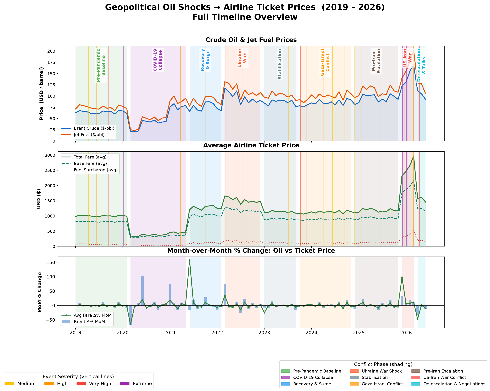
* [fig1_timeline_overview.png](file:///c:/Users/P/oil%20situation/fig1_timeline_overview.png)

**ข้อสรุปสำคัญ (Key Takeaways):**
ภาพรวมแสดงความสัมพันธ์ของการส่งผ่านราคาน้ำมันดิบโลก ไปสู่ราคาตั๋วเครื่องบินตลอดระยะเวลา 7 ปีครึ่ง (ปี 2019 ถึง กลางปี 2026) ภาพนี้ประกอบด้วย 3 กราฟย่อยที่เรียงซ้อนกันบนแกนเวลาเดียวกัน โดยมีเส้นแนวตั้งหลากสีแสดงความรุนแรงของเหตุการณ์ และมีการระบายสีฉากหลังเพื่อแบ่งช่วงเวลาของเหตุการณ์ออกเป็น 9 เฟส (Phases) อย่างชัดเจน

- **กราฟด้านบน (ทิศทางราคาน้ำมัน):** ติดตามความเคลื่อนไหวของราคาน้ำมันดิบ Brent เทียบกับน้ำมันอากาศยาน (Jet Fuel) ตลอด 90 เดือน จะเห็นได้ว่า Jet Fuel มีส่วนต่างราคา (Crack Spread) สูงกว่าน้ำมันดิบอย่างสม่ำเสมอ และทำสถิติพุ่งทะยานสูงสุดถึง $201.05/บาร์เรล ในช่วงสงครามสหรัฐฯ-อิหร่าน ปี 2026

- **กราฟตรงกลาง (โครงสร้างราคาตั๋วเครื่องบิน):** แสดงราคาตั๋วเครื่องบินสุทธิ (Total Fare - เส้นสีเขียวเข้ม) ซึ่งประกอบด้วย ราคาพื้นฐาน (Base Fare - เส้นประสีฟ้า) บวกกับ ค่าธรรมเนียมน้ำมัน (Fuel Surcharges - เส้นจุดสีแดง) จะเห็นได้ว่าค่าธรรมเนียมน้ำมันพุ่งขึ้นอย่างรุนแรงในช่วงวิกฤตพลังงาน โดยกินสัดส่วนสูงถึง 35% ของราคาตั๋วรวมในช่วงที่สถานการณ์ตึงเครียดที่สุด

- **กราฟด้านล่าง (ความผันผวนรายเดือน):** เปรียบเทียบอัตราการเปลี่ยนแปลงรายเดือน (% MoM) ระหว่างราคาน้ำมันดิบ Brent กับราคาตั๋วเครื่องบิน โดยในช่วงปลายปี 2025 (วิกฤตสหรัฐฯ-อิหร่าน) ราคาตั๋วเครื่องบินพุ่งสูงถึง +98% ภายในเดือนเดียว ก่อนจะทิ้งตัวดิ่งลง -48% เมื่อสถานการณ์เข้าสู่ช่วงการเจรจาและผ่อนคลายความตึงเครียด (De-escalation & Talks) ในช่วงกลางปี 2026

---

<a id="fig2"></a>
### Figure 2: การวิเคราะห์ความสัมพันธ์ไขว้และระยะเวลาส่งผ่าน (Lag & Cross-Correlation Analysis)
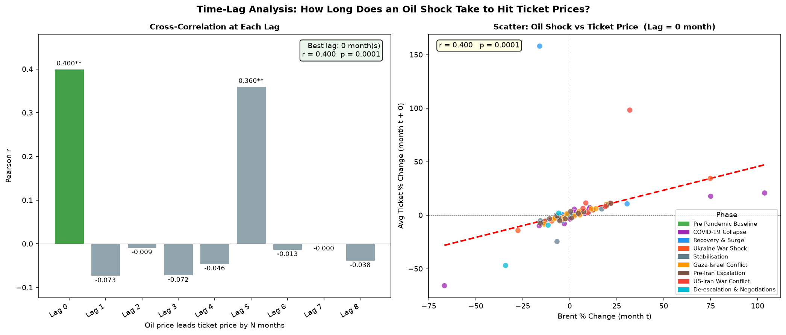
* [fig2_cross_correlation.png](file:///c:/Users/P/oil%20situation/fig2_cross_correlation.png)

**ข้อสรุปสำคัญ (Key Takeaways):**

**กราฟด้านซ้าย: Cross-Correlation at Each Lag**
- กราฟนี้เป็นการวิเคราะห์ "Time-Lag Analysis" เพื่อหาคำตอบว่า "เมื่อเกิดวิกฤต/ความผันผวนของราคาน้ำมัน (Oil Shock) จะใช้เวลานานเท่าใดจึงจะส่งผลกระทบต่อราคาตั๋วเครื่องบิน"
- ประเมินค่าสัมประสิทธิ์สหสัมพันธ์ของเพียร์สัน (Pearson correlation $r$) ข้ามระยะเวลา Lag $k \in [0, 8]$ เดือน ระหว่าง $\text{MoM}\,\%\,\Delta\text{Brent}$ และ $\text{MoM}\,\%\,\Delta\text{Ticket Fare}$
- **สหสัมพันธ์สูงสุด ณ Lag 0 เดือนเดียวกัน - แท่งสีเขียว ($r = +0.400, p = 0.0001$):** ยืนยันว่าราคาตั๋วเครื่องบินปรับตัวภายในเดือนเดียวกันกับที่ราคาน้ำมันเปลี่ยนแปลง โดยมีแรงขับเคลื่อนหลักจากค่าธรรมเนียมน้ำมันที่ปรับตัวแบบไดนามิกผ่านระบบการจองตั๋ว GDS(Global Distribution System)
- **Lag 5 (อีก 5 เดือนถัดมา - แท่งสีเทา):** มีค่าความสัมพันธ์สูงเป็นอันดับสองอยู่ที่ r = 0.360 หมายความว่า เกิดผลกระทบระลอกสอง (Secondary/Delayed effect) ตามมาในอีกประมาณ 5 เดือนถัดไปซึ่งอาจเกิดจากการปรับโครงสร้างต้นทุนตั๋วเครื่องบินล่วงหน้าหรือการปรับเปลี่ยนนโยบายการจองตั๋ว

**กราฟด้านขวา: Scatter Plot (Oil Shock vs Ticket Price ที่ Lag = 0)** 
- กราฟจุดแสดงความสัมพันธ์แบบกระจายตัวระหว่าง % การเปลี่ยนแปลงของราคาน้ำมันดิบ Brent (X-axis) กับ % การเปลี่ยนแปลงของราคาตั๋วเครื่องบินเฉลี่ย (Y-axis) ในเดือนเดียวกัน (Lag = 0)
- เส้นแนวโน้ม (Red Dashed Trendline): เฉียงขึ้นไปทางขวา แสดงถึงความสัมพันธ์ทิศทางบวก (r=0.400) หมายความว่าเมื่อราคาน้ำมันดิบปรับตัวสูงขึ้น ราคาตั๋วเครื่องบินเฉลี่ยมักจะปรับตัวสูงขึ้นตาม

---

<a id="fig3"></a>
### Figure 3: ผลกระทบตามความรุนแรงของเหตุการณ์และความขัดแย้ง (Impact by Event Severity & Conflict Phase)
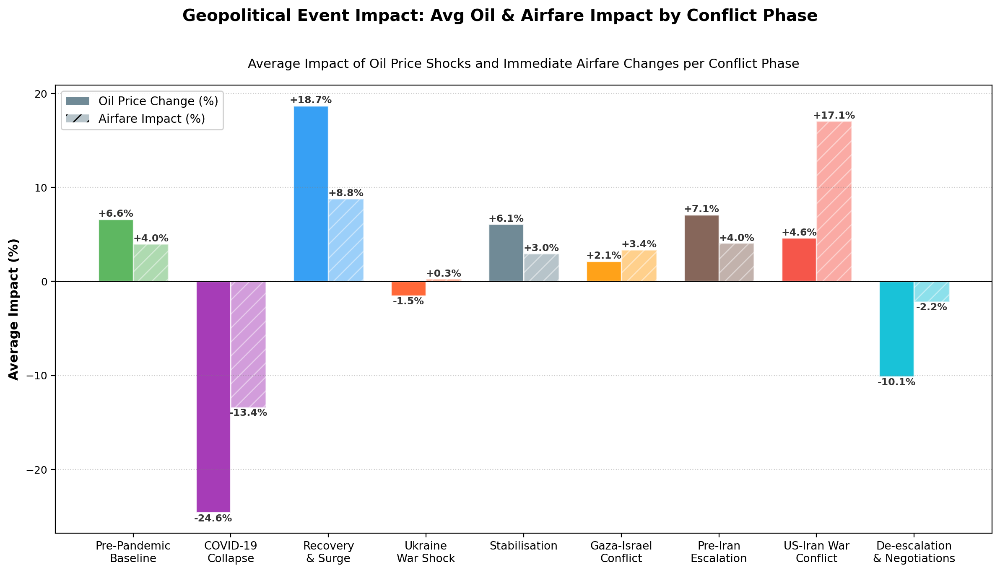
* [fig3_event_impact.png](file:///c:/Users/P/oil%20situation/fig3_event_impact.png)

**ข้อสรุปสำคัญ (Key Takeaways):**
- กราฟแท่งคู่แสดงเปรียบเทียบ % การเปลี่ยนแปลงเฉลี่ยของราคาน้ำมัน (แท่งทึบ) กับ % ผลกระทบต่อราคาตั๋ว (แท่งลาย/สีอ่อน) ในแต่ละช่วงความขัดแย้ง

- ในช่วง **US-Iran War Conflict** สร้างผลกระทบต่อการเปลี่ยนแปลงราคาตั๋วเฉลี่ยสูงถึง +17.07\% ทั้งที่ราคาน้ำมันเพิ่มขึ้นเพียง +4.6% ในช่วงสงครามหรือความขัดแย้งระดับนี้ นอกจากค่าน้ำมันแล้ว ตั๋วเครื่องบินยังมีต้นทุนเพิ่มขึ้นจาก การปิดน่านฟ้า (Airspace Closures), การบินอ้อมเส้นทาง (Rerouting) และการยกเลิกเที่ยวบินจำนวนมาก

---

<a id="fig4"></a>
### Figure 4: แดชบอร์ดสรุปราคาตั๋วและราคาน้ำมันรายเหตุการณ์วิกฤต (Oil vs. Airfare: Phase Analysis Dashboard)
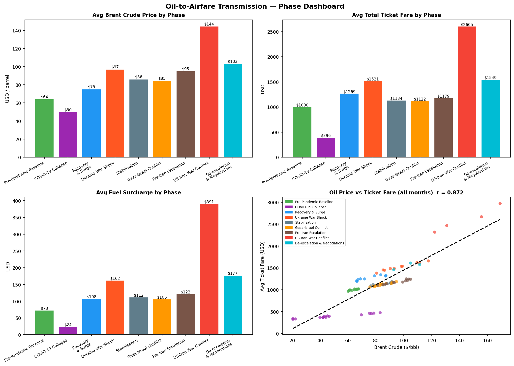
* [fig4_phase_dashboard.png](file:///c:/Users/P/oil%20situation/fig4_phase_dashboard.png)

**ข้อสรุปสำคัญ (Key Takeaways):**

แดชบอร์ดสรุปกลไกการส่งผ่านราคาน้ำมันดิบไปสู่ราคาตั๋วเครื่องบิน โดยเปรียบเทียบข้อมูลใน 9 ช่วงเหตุการณ์สำคัญ (Phases)
แดชบอร์ดแบ่งออกเป็น 4 กราฟย่อยดังนี้

**- กราฟซ้ายบน: Avg Brent Crude Price by Phase (ราคาน้ำมันดิบ Brent เฉลี่ย)
แสดงราคาน้ำมันดิบโลก (เหรียญสหรัฐฯ ต่อบาร์เรล) ในแต่ละช่วงเวลา**

 - จุดต่ำสุด: ช่วง COVID-19 Collapse ($50/bbl)
 - ระดับปกติก่อนโควิด: Pre-Pandemic Baseline ($64/bbl)
 - จุดสูงสุด: ช่วง **US-Iran War Conflict ($144/bbl)$** พุ่งขึ้นเกิน2เท่าจากระดับปกติตามด้วยช่วงสงครามยูเครน ($97/bbl)

**- กราฟขวาบน: Avg Total Ticket Fare by Phase (ราคาตั๋วเครื่องบินรวมเฉลี่ย)
แสดงราคาตั๋วเครื่องบินเฉลี่ยต่อใบ (เหรียญสหรัฐฯ) ซึ่งเคลื่อนไหวสอดคล้องกับราคาน้ำมันดิบอย่างรวดเร็ว**
 - จุดต่ำสุด: ช่วง COVID-19 Collapse ($396) จากความต้องการเดินทางที่ลดลงอย่างรุนแรง
 - ระดับปกติก่อนโควิด: Pre-Pandemic Baseline ($1,000)
 - จุดสูงสุด: ช่วง US-Iran War Conflict ($2,605) เพิ่มขึ้นถึง 2.6 เท่าจากราคาปกติ!

**- กราฟซ้ายล่าง: Avg Fuel Surcharge by Phase (ค่าธรรมเนียมเชื้อเพลิงเฉลี่ย)
แสดง Fuel Surcharge ซึ่งเป็นเครื่องมือหลักที่สายการบินใช้ปรับราคาตั๋วเพื่อสะท้อนต้นทุนน้ำมัน**
 - ช่วง COVID-19 Collapse: ลดลงเหลือเพียง $24
 - ช่วง Ukraine War Shock: ปรับขึ้นเป็น $162
 - ช่วง US-Iran War Conflict: พุ่งสูงเป็นประวัติการณ์ถึง $391 (คิดเป็นประมาณ 15% ของราคาตั๋วรวมทั้งหมด) 

**- กราฟขวาล่าง: Oil Price vs Ticket Fare (all months) 
กราฟกระจายตัวแสดงความสัมพันธ์ระหว่าง ราคาน้ำมันดิบ (แกน X) กับ ราคาตั๋วเครื่องบินรวม (แกน Y) ของทุกเดือน** 
 - กราฟความสัมพันธ์แบบ Scatter Regression แสดงความสัมพันธ์เชิงเส้นเป็นบวกที่แข็งแกร่งระหว่างราคาน้ำมัน Brent ($/บาร์เรล) และราคาตั๋วเครื่องบินเฉลี่ย (USD) ($r = +0.872$)
 - ความหมาย: เมื่อราคาน้ำมันดิบปรับเพิ่มขึ้น ราคาตั๋วเครื่องบินก็จะปรับตัวสูงขึ้นตามอย่างแม่นยำแทบจะทันทีในทุกช่วงเวลา

---

<a id="fig5"></a>
### Figure 5: การเปรียบเทียบผลกระทบจาก 3 เหตุการณ์ใหญ่ ช่วงโควิด19, สงครามรัสเซีย-ยูเครน และสงครามอิหร่าน ($T_0=100$) (Three-Shock Trajectory Comparison)
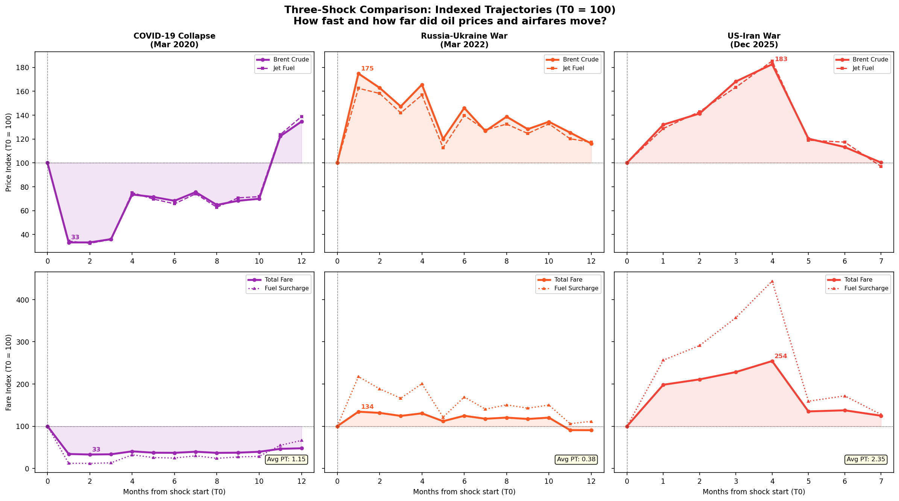
* [fig5_three_shock_trajectories.png](file:///c:/Users/P/oil%20situation/fig5_three_shock_trajectories.png)

**ข้อสรุปสำคัญ (Key Takeaways):**

เปรียบเทียบพฤติกรรมการเคลื่อนไหวของราคาน้ำมันดิบและราคาตั๋วเครื่องบินใน 3 เหตุการณ์วิกฤตใหญ่ของโลก
โดยปรับฐานดัชนีทุกเหตุการณ์ให้เท่ากับ $T_0 = 100$ ณ เดือนที่เกิดวิกฤต เพื่อดูว่าราคาตอบสนองเร็วแค่ไหน

- **COVID-19 (2020):** ทั้งดรรชนีน้ำมันและตั๋วเครื่องบินดิ่งลงเหลือดัชนีราว 33(ลดลง -67%)
- **สงครามยูเครน (2022):** ดรรชนีน้ำมันขึ้นไปที่ ~175(+75%) ในขณะที่ราคาตั๋วปรับขึ้นไปที่ ~134(+34%)
- **สงครามสหรัฐฯ-อิหร่าน (2025–2026):** เกิดการฉีกตัวอย่างรุนแรง—ในขณะที่น้ำมันขึ้นไปที่ ~183(+83%) ราคาตั๋วเครื่องบินพุ่งทะลุ 254(+154%) เนื่องจากการสะสมของต้นทุนการดำเนินงาน (การบินอ้อมน่านฟ้าตะวันออกกลาง ค่าประกันภัยที่สูงขึ้น และ Crack Spread ของ Jet Fuel)

---

<a id="fig6"></a>
### Figure 6: อัตราการส่งผ่านราคา (Pass-Through Rates)
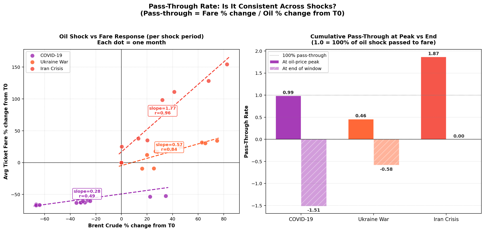
* [fig6_pass_through_rates.png](file:///c:/Users/P/oil%20situation/fig6_pass_through_rates.png)

**ข้อสรุปสำคัญ (Key Takeaways):**

**กราฟด้านซ้าย: Oil Shock vs Fare Response (ความชัน / Slope ของแต่ละวิกฤต)**

- Iran Crisis: Slope = 1.77 (r=0.96) ทุกๆ การเพิ่มขึ้นของน้ำมัน +1% ราคาตั๋วพุ่งขึ้นถึง +1.77% (ความสัมพันธ์สูงมากเกือบเป็นเส้นตรง)

- Ukraine War: Slope = 0.57 (r=0.84) ทุกๆ การเพิ่มขึ้นของน้ำมัน +1% ราคาตั๋วเพิ่มขึ้น +0.57%

- COVID-19: Slope = 0.28 (r=0.49) 
ความชันต่ำที่สุดเนื่องจากความต้องการเดินทางหยุดชะงัก

**กราฟด้านขวา: Cumulative Pass-Through at Peak vs End (การส่งผ่าน ณ จุด Peak เทียบกับจุดสิ้นสุด)
เปรียบเทียบค่า Pass-Through ณ ช่วงที่ราคาน้ำมันขึ้นสูงสุด (Peak - เสาทึบ) กับ จุดสิ้นสุดกรอบเวลา (End - เสาลาย)**
- คำนวณอัตราการส่งผ่านราคาเชิงประจักษ์ $PT = \frac{\% \Delta \text{Airfare}}{\% \Delta \text{Oil}}$ 

- COVID-19: สูงสุดอยู่ที่ 0.99 (ส่งผ่านราคาเกือบ 100% พอดี)
- Ukraine War: สูงสุดอยู่ที่ 0.46 (ส่งผ่านราคาเพียง 46%)
- Iran Crisis: สูงถึง 1.87 (ส่งผ่านราคาไปถึง 187% หรือเกือบ 2 เท่าของน้ำมัน)

---

<a id="fig7"></a>
### Figure 7: เจาะลึกวิกฤตการณ์ช่วงโควิด19, สงครามรัสเซีย-ยูเครน และสงครามอิหร่าน (Covid-19, Russia-Ukraine and Iran Crisis Deep Dive)
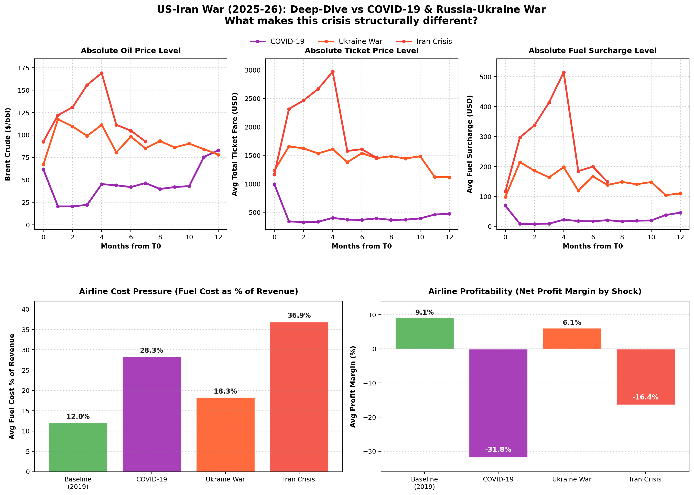
* [fig7_iran_deepdive.png](file:///c:/Users/P/oil%20situation/fig7_iran_deepdive.png)

**ข้อสรุปสำคัญ (Key Takeaways):**

เป็นการเจาะลึกเพื่อตอบคำถามสำคัญว่า "วิกฤตสงคราม US-Iran (2025-26) มีความแตกต่างเชิงโครงสร้าง จากวิกฤต COVID-19 และสงครามยูเครนอย่างไร

**แถบบน: ระดับราคาจริง(Absolute Price Levels)**

- ราคาน้ำมันดิบ Brent (ซ้ายบน):
Iran Crisis (สีแดง): พุ่งขึ้นทำจุดสูงสุดที่ 169/bbl ในเดือนที่ 4 สูงกว่าวิกฤตยูเครน(สีส้ม 118/bbl) อย่างเห็นได้ชัด

- ราคาตั๋วเครื่องบินรวม (กลางบน):
Iran Crisis (สีแดง):ทะยานพุ่งสูงถึงเฉลี่ยเกือบ 3,000USD(2,980) ในเดือนที่ 4 (สูงเป็น 3 เท่าของระดับปกติที่ $1,000)

- ค่าธรรมเนียมเชื้อเพลิง Fuel Surcharge (ขวาบน):
Iran Crisis (สีแดง): ทะลุ $515 USD ในเดือนที่ 4 ทำสถิติสูงสุดเป็นประวัติการณ์

**แถบล่าง: ผลกระทบเชิงโครงสร้างและการเงิน (Structural & Financial Impacts)**

- แรงกดดันต้นทุนน้ำมันของสายการบิน (Fuel Cost % of Revenue - ซ้ายล่าง):
    - Baseline (2019): ต้นทุนน้ำมันอยู่ที่ 12.0% ของรายได้สายการบิน
    - Ukraine War: ต้นทุนน้ำมันเพิ่มเป็น 18.3%
    - Iran Crisis: ต้นทุนน้ำมันพุ่งสูงถึง 36.9% ของรายได้ (ค่าน้ำมันกลืนกินรายได้ไปมากกว่า 1 ใน 3 ของสายการบิน)
- อัตรากำไรสุทธิของสายการบิน (Net Profit Margin - ขวาล่าง):
    - Baseline (2019): กำไรสุทธิอยู่ที่ +9.1%
    - Ukraine War: สายการบินยังคงบริหารจัดการจนมี กำไรสุทธิ +6.1%
    - Iran Crisis: สายการบินพลิกกลับมา ขาดทุนสุทธิหนักถึง -16.4% (เป็นรองแค่ช่วงวิกฤตโควิดที่ขาดทุน -31.8%)


---

<a id="fig8"></a>
### Figure 8: ผลลัพธ์จากการประกันราคาน้ำมัน (Fuel Hedging Timing & Savings)
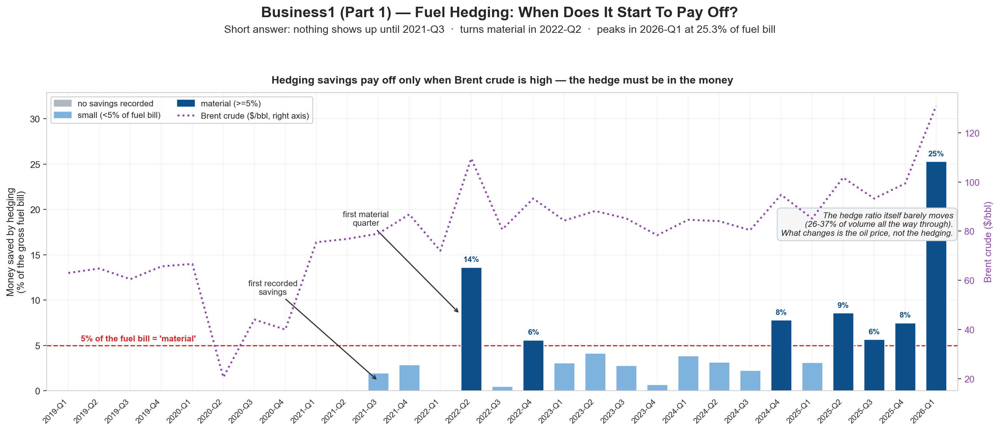
* [fig8_hedging_timing.png](file:///c:/Users/P/oil%20situation/fig8_hedging_timing.png)

**ข้อสรุปสำคัญ (Key Takeaways):**

 การวิเคราะห์ประสิทธิภาพของ การประกันความเสี่ยงราคาน้ำมัน (Fuel Hedging) ของสายการบิน ว่า เริ่มเห็นผลเมื่อไร ประหยัดเงินได้เท่าใด และการทำ Hedging สัดส่วนมากๆ ช่วยให้สายการบินรอดพ้นวิกฤตได้ดีกว่าจริงหรือไม่?

 การทำ Fuel Hedging แทบ ไม่เห็นผลเลยในภาวะปกติ แต่จะเริ่มเห็นผลประหยัดเงินอย่างมีนัยสำคัญเมื่อเกิดวิกฤตราคาน้ำมันดิบพุ่งสูง (In the money) โดยคุ้มค่าสูงสุดใน ไตรมาส 1 ปี 2026 (วิกฤตอิหร่าน) ช่วยเซฟอัตรากำไรสุทธิขึ้นมาได้ถึง +8.1 percentage points (pp)

 - 2019-Q1 ถึง 2021-Q2 (แท่งสีเทา): ไม่บันทึกผลการประหยัดเงินเลย (No savings) เนื่องจากราคาน้ำมันดิบโลกต่ำ สัญญา Hedge ไม่ได้อยู่ในสถานะกำไร (Out of the money)
 - 2022-Q2 (ช่วงสงครามยูเครน): เป็นไตรมาสแรกที่เห็นผลอย่างมีนัยสำคัญ (First material quarter - แท่งสีน้ำเงินเข้ม) ประหยัดค่าน้ำมันได้ 14% ของค่าน้ำมันรวม
 - 2026-Q1 (ช่วงวิกฤตอิหร่าน): ทำสถิติประหยัดค่าน้ำมันสูงสุดเป็นประวัติการณ์ถึง 25% ของค่าน้ำมันรวม!
 - ข้อสังเกต: สัดส่วนการทำ Hedging (Hedge Ratio) ของสายการบินแทบจะคงที่ตลอดช่วงเวลาที่ 26% − 37% ของปริมาณน้ำมัน สิ่งที่เปลี่ยนไม่ใช่พฤติกรรมสายการบิน แต่คือราคาน้ำมันดิบโลกที่พุ่งสูงขึ้น

---

<a id="fig9"></a>
### Figure 9: ผลกระทบจากการประกันราคาน้ำมันต่ออัตรากำไรสุทธิ (Hedging Impact & Margin Cushion)
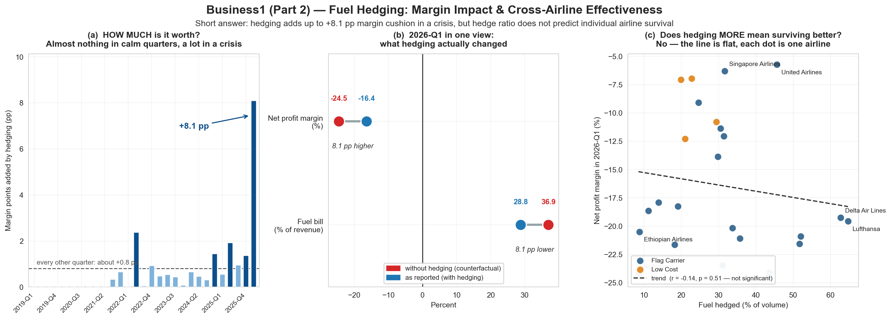
* [fig9_hedging_impact.png](file:///c:/Users/P/oil%20situation/fig9_hedging_impact.png)

ภาพรวมการทำ Fuel Hedging สายการบินส่วนใหญ่แทบ ไม่เห็นผลเลยในภาวะปกติ แต่จะเริ่มเห็นผลประหยัดเงินอย่างมีนัยสำคัญเมื่อเกิดวิกฤตราคาน้ำมันดิบพุ่งสูง (In the money) โดยคุ้มค่าสูงสุดใน ไตรมาส 1 ปี 2026 (วิกฤตอิหร่าน) ช่วยเซฟอัตรากำไรสุทธิขึ้นมาได้ถึง +8.1 percentage points (pp)

**ข้อสรุปสำคัญ (Key Takeaways):**

(a)(กราฟด้านซ้าย) — การทำประกันราคาน้ำมันช่วยเพิ่ม Margin ได้มากเท่าใด?
- ไตรมาสปกติทั่วไป: การทำประกันราคาน้ำมัน ช่วยเพิ่ม Net Profit Margin เพียงเล็กน้อยเฉลี่ยราว +0.8 pp
- ไตรมาสวิกฤต (2026-Q1): การทำประกันราคาน้ำมัน ช่วยเพิ่ม Net Profit Margin สูงสุดถึง +8.1 pp!

(b)(กราฟตรงกลาง) สิ่งที่ การประกันราคาน้ำมัน ช่วยทำให้เกิดการเปลี่ยนแปลงไปในช่วงวิกฤตอิหร่าน
เปรียบเทียบระหว่างตัวเลขจริง (กรณีทำประกัน - จุดสีฟ้า) กับ ตัวเลขจำลองกรณีไม่มีการทำประกัน - จุดสีแดง):

- สัดส่วนต้นทุนน้ำมัน (ต่อ % ของรายได้): หากไม่มีการทำประกันราคาน้ำมัน สัดส่วนต้นทุนน้ำมันจะสูงถึง 36.9% แตเมื่อมีการทำประกันราคาน้ำมัน สัดส่วนต้นทุนจะลดลงเหลือ 28.8% (ลดลง 8.1 pp)
- อัตรากำไรสุทธิ (Net Profit Margin): หากไม่มีการทำประกันราคาน้ำมัน สายการบินจะขาดทุนหนักถึง -24.5% แต่การทำประกันราคาน้ำมันช่วยพยุงตัวเลขกลับขึ้นมาเป็น -16.4% (เซฟ Margin ขึ้นมา 8.1 pp)

(c)(กราฟด้านขวา) การทำประกันราคาน้ำมันด้วยสัดส่วนที่สูงกว่าช่วยให้สายการบินมีผลกำไรที่ดีกว่าจริงไหม?

- คำตอบคือ "ไม่จริงเสมอไป"  กราฟพล็อตระหว่าง % การทำประกันราคาน้ำมัน(แกน X) กับ อัตรากำไรสุทธิ 2026-Q1 (แกน Y) แสดงเส้นแนวโน้มราบเรียบและไม่มีนัยสำคัญทางสถิติ (r=−0.14,p=0.51)

- ตัวอย่าง: สายการบินที่ทำประกันราคาน้ำมัน สัดส่วนสูงมาก (>60%) เช่น Delta Air Lines หรือ Lufthansa ยังคงขาดทุนหนัก (−19%) ในขณะที่สายการบินที่ทำประกันราคาน้ำมัน ปานกลาง (35−40%) อย่าง Singapore Airlines หรือ United Airlines กลับมี Profit Margin ที่ดีกว่า (−6%)

- เหตุผล: การทำประกันราคาน้ำมัน ช่วยลดแรงกระแทกเรื่องราคาน้ำมันได้เพียงส่วนหนึ่งแต่การอยู่รอดในวิกฤตสงครามขึ้นอยู่กับปัจจัยการดำเนินงานอื่นร่วมด้วย เช่น โครงสร้างเส้นทางบิน การปิดน่านฟ้า และความยืดหยุ่นในการปรับราคาตั๋ว

---

<a id="fig10"></a>
### Figure 10: โครงสร้างภาระต้นทุนจากผลกระทบการปิดช่องแคบฮอร์มุซ ส่วนที่ 1 (Strait of Hormuz Carrier Burden Breakdown Part 1)
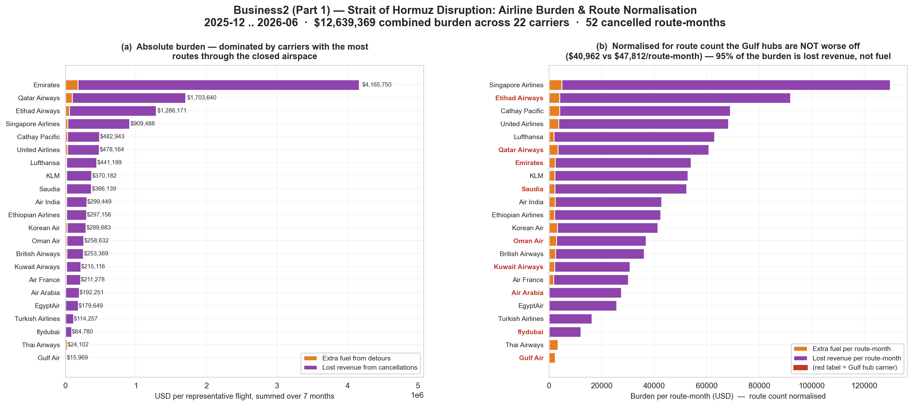
* [fig10_reroute_cost.png](file:///c:/Users/P/oil%20situation/fig10_reroute_cost.png)

**ข้อสรุปสำคัญ (Key Takeaways):**

เป็นการวิเคราะห์ภาระความเสียหายทางการเงินสุทธิต่อสายการบิน 22 แห่งทั่วโลก จากเหตุการณ์วิกฤตปิดน่านฟ้าและปิดช่องแคบฮอร์มุซตลอดระยะเวลา 7 เดือน (ธันวาคม 2025 – มิถุนายน 2026)

- ภาระความเสียหายรวมทั้งอุตสาหกรรม: $12,639,369 USD (12.64 ล้านเหรียญสหรัฐ) คิดจากสายการบิน 22 แห่ง
จำนวนเส้นทางบินที่ถูกยกเลิกสะสม: 52 รูท/เดือน

(a)(กราฟด้านซ้าย) Absolute Burden — ภาระความเสียหายในรูปมูลค่าเงินจริง (USD)
แสดงยอดรวมความเสียหายสะสม 7 เดือน ของสายการบินเรียงจากมากไปน้อย:

- สายการบินตะวันออกกลาง (Gulf Hubs) ครองอันดับสูงสุด: เนื่องจากเป็นศูนย์กลางการบินที่มีเครือข่ายเส้นทางบินผ่านพื้นที่ปิดน่านฟ้ามากที่สุด

- โครงสร้างความเสียหาย: แท่งสีม่วง (สูญเสียรายได้) ยาวกว่าแท่งสีส้ม (ค่าน้ำมันบินอ้อม) อย่างมหาศาลในเกือบทุกสายการบิน

(b)(กราฟด้านขวา) Normalised Burden — ภาระความเสียหายเฉลี่ยต่อเส้นทางบิน (USD / รูท/เดือน)

- คำถาม: "สายการบินตะวันออกกลางเสียหายหนักกว่าสายการบินอื่นจริงหรือไม่?"
- คำตอบ: "ไม่จริง" เมื่อปรับสเกลตามจำนวนเส้นทางบินแล้ว สายการบินตะวันออกกลาง (ป้ายสีแดง) มีภาระความเสียหายเฉลี่ยอยู่ที่ 40,962 USD/รูท/เดือน ซึ่งต่ำกว่าสายการบินนอกตะวันออกกลาง(ป้ายสีดำ)ที่มีภาระเฉลี่ยถึง47,812 USD/ รูท/เดือน
อันดับความเสียหายสูงสุดต่อเส้นทาง:
   - Singapore Airlines: สูงที่สุดในโลกที่ ~$130,000 / รูท/เดือน (เนื่องจากเส้นทางบินข้ามทวีป Asia-Europe มีรายได้ต่อเที่ยวบินสูงมาก เมื่อถูกยกเลิกจึงสูญเสียรายได้ต่อเส้นทางหนักที่สุด)
   - Etihad Airways: ~$92,000 / รูท/เดือน
   - Cathay Pacific: ~$68,000 / รูท/เดือน
   - United Airlines: ~$67,000 / รูท/เดือน
   - Lufthansa: ~$63,000 / รูท/เดือน
   - Thai Airways (การบินไทย): มีภาระต่อเส้นทางต่ำมากอยู่ที่ประมาณ ~$4,000 / รูท/เดือน และความเสียหายเกือบทั้งหมดมาจากค่าน้ำมันจากการบินอ้อม (แท่งสีส้ม)


---

<a id="fig11"></a>
### Figure 11: โครงสร้างภาระต้นทุนจากผลกระทบการปิดช่องแคบฮอร์มุซ ส่วนที่ 2 (Strait of Hormuz Carrier Burden Breakdown Part 2)
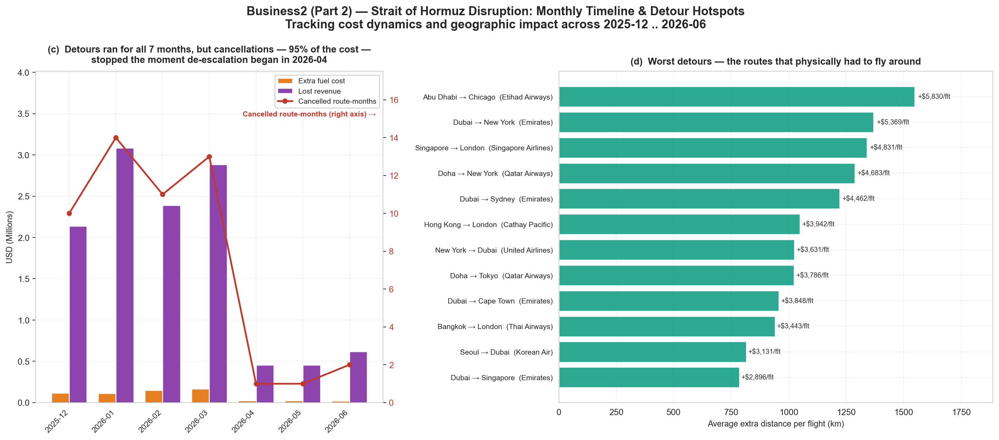
* [fig11_reroute_monthly_detours.png](file:///c:/Users/P/oil%20situation/fig11_reroute_monthly_detours.png)

**ข้อสรุปสำคัญ (Key Takeaways):**

(c)(กราฟด้านซ้าย) Monthly Timeline — ไทม์ไลน์รายเดือนและการผ่อนคลายความตึงเครียด
   - กราฟแสดงมูลค่าความเสียหายรายเดือน (แกน Y ซ้าย) ควบคู่กับจำนวนเส้นทางที่ถูกยกเลิก (เส้นสีแดง - แกน Y ขวา):
   - ช่วงวิกฤตรุนแรงสูงสุด (ธ.ค. 2025 – มี.ค. 2026):
      * มกราคม 2026 (Peak 1): ถูกยกเลิกสูงสุด 14 cancelled route-months และสูญเสียรายได้สูงถึง ~$3.1 ล้านเหรียญ/เดือน
      * มีนาคม 2026 (Peak 2): ยังคงสูงที่ 13 cancelled route-months และสูญเสียรายได้ ~$2.9 ล้านเหรียญ/เดือน
      * จุดเปลี่ยนสำคัญในเดือนเมษายน 2026 (De-escalation):
         * เมื่อเริ่มการเจรจาผ่อนคลายในเดือน 2026-04 จำนวนเส้นทางถูกยกเลิก ดิ่งลงทันทีจาก 13 เหลือเพียง 1 เส้นทาง
         * ความสูญเสียรายได้ดิ่งลงจาก 2.9 ล้าน เหลือเพียง 0.45 ล้าน ต่อเดือน

   (d)(กราฟด้านขวา) Worst Detours — 12 เส้นทางที่ต้องบินอ้อมหนักที่สุดในโลก
   - กราฟแท่งแนวนอนแสดงระยะทางบินอ้อมเพิ่มเฉลี่ยต่อเที่ยวบิน (กิโลเมตร) และค่าน้ำมันส่วนเพิ่มต่อเที่ยวบิน (+USD/เที่ยวบิน):

   - เส้นทางที่บินอ้อมหนักที่สุด: เส้นทาง Abu Dhabi → Chicago (Etihad Airways) ต้องบินอ้อมเพิ่มขึ้นถึง ~1,550 กิโลเมตร/เที่ยว เพิ่มค่าน้ำมันสูงถึง +5,830 USD ต่อเที่ยวบิน

   - เส้นทางบินของไทยได้รับผลกระทบจากค่าน้ำมันอ้อม: เส้นทาง กรุงเทพฯ → ลอนดอน (การบินไทย) ติดอันดับ 10 ของโลกที่ต้องบินอ้อมหลบพื้นที่ตึงเครียดเพิ่มขึ้นถึง 940 กิโลเมตรต่อเที่ยว ส่งผลให้มีค่าน้ำมันส่วนเพิ่มเกิดขึ้นประมาณ 3,443 USD (ราว 1.2 แสนบาท) ต่อหนึ่งเที่ยวบิน

---

<a id="fig12"></a>
### Figure 12: ราคาน้ำมันดิบและจุดคุ้มทุนของสายการบิน (Airline Break-Even Brent Prices)
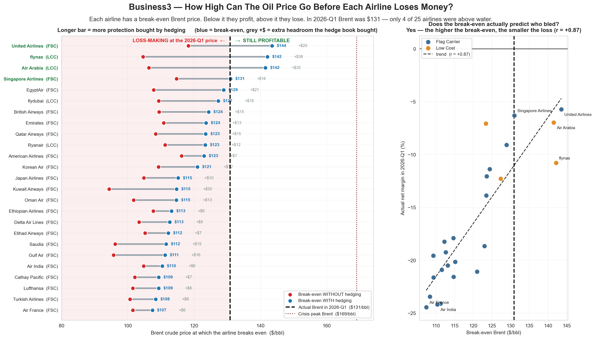
* [fig12_breakeven_brent.png](file:///c:/Users/P/oil%20situation/fig12_breakeven_brent.png)

**ข้อสรุปสำคัญ (Key Takeaways):**

- เป็นการวิเคราะห์ จุดคุ้มทุนราคาน้ำมันดิบ (Break-Even Brent Price) ของสายการบินแต่ละแห่ง เพื่อตอบคำถามว่า ราคาน้ำมันดิบโลกสามารถพุ่งสูงขึ้นไปได้ถึงเท่าใด ก่อนที่สายการบินแต่ละแห่งจะเริ่มประสบภาวะขาดทุน?

- ในไตรมาส 2026-Q1 (ช่วงวิกฤตสงครามอิหร่าน) ราคาน้ำมันดิบ Brent เฉลี่ยพุ่งขึ้นไปถึง 131 USD/bbl (เส้นประแนวตั้งสีดำ) ส่งผลให้จาก 25 สายการบินชั้นนำทั่วโลก มีเพียง 4 สายการบินเท่านั้นที่ยังคงทำกำไรอยู่ได้ ส่วนอีก 21 สายการบินที่เหลือต้องตกอยู่ในภาวะขาดทุน

(กราฟด้านซ้าย) Dumbbell Chart แสดง Break-Even Price รายสายการบิน (เรียงจากสูงไปต่ำ)
กราฟนี้เปรียบเทียบจุดคุ้มทุนของ 25 สายการบิน ทั้งกรณีไม่มี การทำประกันราคาน้ำมัน และมีการทำประกันราคาน้ำมัน โดย 

 - จุดสีแดง (Red Dot): จุดคุ้มทุนราคาน้ำมันดิบกรณี ไม่มีการทำประกัน
 - จุดสีฟ้า (Blue Dot): จุดคุ้มทุนราคาน้ำมันดิบกรณี มีการทำประกัน
 - แท่งสีเทา (Grey Bar): ระยะค้ำยันพิเศษ (Extra Headroom / Buffer) ที่สัญญา การทำประกันราคาน้ำมัน ช่วยขยายขอบเขตความคุ้มทุนเพิ่มขึ้นมา
 - 4 สายการบินที่ยังทำกำไรได้ใน 2026-Q1 ได้แก่ United Airlines, flynas, Air Arabia และ Singapore Airlines

(กราฟด้านขวา) Scatter Plot พิสูจน์ความแม่นยำของค่า Break-Even
พล็อตความสัมพันธ์ระหว่าง จุดคุ้มทุน Break-Even Brent (แกน X) กับ อัตรากำไรสุทธิจริงใน 2026-Q1 (แกน Y):
  - เส้นแนวโน้มเฉียงขึ้นอย่างชัดเจน แสดงว่าสายการบินที่มีจุดคุ้มทุน Break-Even สูงกว่า จะมี Net Margin ที่ดีกว่าหรือขาดทุนน้อยกว่าอย่างเห็นได้ชัด (r=+0.87)
---

<a id="dataset-schema"></a>
## 📑 เค้าโครงชุดข้อมูล (Dataset Schema)

คลังข้อมูลนี้ใช้ชุดข้อมูล CSV 6 ชุดที่เชื่อมโยงกัน:

| ชื่อไฟล์ | คำอธิบาย | คุณลักษณะสำคัญ (Key Features) | จำนวนแถว |
| :--- | :--- | :--- | :---: |
| [`oil_jet_fuel_prices.csv`](file:///c:/Users/P/oil%20situation/oil_jet_fuel_prices.csv) | ราคาน้ำมันดิบและน้ำมัน Jet Fuel รายเดือน | `month`, `brent_crude_usd_barrel`, `jet_fuel_usd_barrel`, `strait_hormuz_disrupted`, `conflict_phase` | 90 |
| [`conflict_oil_events.csv`](file:///c:/Users/P/oil%20situation/conflict_oil_events.csv) | บันทึกเหตุการณ์ภูมิรัฐศาสตร์ | `event_date`, `event_type`, `severity`, `oil_price_change_pct`, `airfare_impact_pct`, `flight_cancellations_est` | 39 |
| [`airline_ticket_prices.csv`](file:///c:/Users/P/oil%20situation/airline_ticket_prices.csv) | ราคาตั๋วเครื่องบินระดับเส้นทางรายเดือน | `month`, `airline`, `route_class`, `base_fare_usd`, `fuel_surcharge_usd`, `total_fare_usd`, `load_factor_pct` | 14,850 |
| [`airline_financial_impact.csv`](file:///c:/Users/P/oil%20situation/airline_financial_impact.csv) | ตัวชี้วัดทางการเงินและการดำเนินงาน | `month`, `airline`, `fuel_cost_pct_opex`, `operating_margin_pct`, `profit_margin_pct`, `fuel_hedging_pct` | 725 |
| [`fuel_surcharges.csv`](file:///c:/Users/P/oil%20situation/fuel_surcharges.csv) | รายละเอียดค่าธรรมเนียมน้ำมัน | `month`, `airline`, `route_class`, `fuel_surcharge_usd`, `surcharge_pct_of_total` | 10,440 |
| [`route_cost_impact.csv`](file:///c:/Users/P/oil%20situation/route_cost_impact.csv) | ตัวชี้วัดการบินอ้อมเส้นทางและต้นทุน | `month`, `route_id`, `flight_time_minutes`, `reroute_extra_time_min`, `extra_fuel_burn_liters` | 3,240 |

---

<a id="methodology"></a>
## 🔬 ระเบียบวิธีวิจัย (Methodology)

1. **การรวมกลุ่มข้อมูลรายเดือน (Monthly Merged Aggregations):**  
   คำนวณค่าเฉลี่ยถ่วงน้ำหนักรายเดือนสำหรับราคาตั๋วพื้นฐาน ค่าธรรมเนียมน้ำมัน ราคาตั๋วรวม อัตราการบรรทุกผู้โดยสาร และสัดส่วนค่าน้ำมันต่อ OpEx จากทั้ง 33 สายการบิน
2. **การประมาณค่าความสัมพันธ์ไขว้และ Lag Structure:**  
   คำนวณค่าสัมประสิทธิ์สหสัมพันธ์ของเพียร์สัน $r(k)$ ระหว่างการเปลี่ยนแปลงราคาน้ำมันรายเดือน $\Delta \text{Oil}_{t-k}$ และการเปลี่ยนแปลงราคาตั๋วเครื่องบิน $\Delta \text{Fare}_t$ สำหรับ Lag $k \in [0, 8]$
3. **การปรับดรรชนีช็อก ($T_0=100$):**  
   ปรับดรรชนีราคาน้ำมันดิบ น้ำมัน Jet Fuel ราคาตั๋วรวม และค่าธรรมเนียมน้ำมันเป็น 100 ณ เดือนฐาน $T_0$ ก่อนเกิดแต่ละวิกฤต:
   $$\text{Index}_t = \left(\frac{X_t}{X_{T_0}}\right) \times 100$$
4. **การคำนวณอัตราการส่งผ่านราคา ($PT$):**  
   คำนวณอัตราการส่งผ่านราคาเชิงประจักษ์เป็นสัดส่วนการเปลี่ยนแปลงสะสมของราคาตั๋วเทียบกับการเปลี่ยนแปลงสะสมของราคาน้ำมัน:
   $$PT_t = \frac{(\text{Fare}_t - \text{Fare}_{T_0}) / \text{Fare}_{T_0}}{(\text{Oil}_t - \text{Oil}_{T_0}) / \text{Oil}_{T_0}}$$
5. **การสร้างโมเดลความสัมพันธ์ราคา Brent จุดคุ้มทุน:**  
   สร้างสมการถดถอยเชิงเส้นระหว่างอัตรากำไรกับราคาน้ำมันดิบ Brent สำหรับแต่ละสายการบิน (ยกเว้นช่วง COVID-19) เพื่อหาราคา Brent จุดคุ้มทุนกรณีมี vs. ไม่มี Hedging:
   $$\text{Margin}_i = \alpha + \beta \times \text{Brent} \implies \text{Break-Even Brent} = -\frac{\alpha}{\beta}$$

---

<a id="repository-structure"></a>
## 📁 โครงสร้างคลังรหัส (Repository Structure)

```
oil situation/
├── README.md                          # เอกสารฉบับภาษาอังกฤษ (English Documentation)
├── README.md                       # เอกสารฉบับภาษาไทย (Thai Documentation)
├── CLAUDE.md                          # แนวทางการพัฒนาและดรรชนีกราฟสำหรับนักพัฒนา
├── path.py                            # ไฟล์กำหนดเส้นทางข้อมูลกลาง (Data Path Configuration)
├── analysis.py                        # สคริปต์ประมวลผลคำถามมหาภาค Q1 (Figures 1-4)
├── analysis2.py                       # สคริปต์เปรียบเทียบ 3 ช็อก Q2 (Figures 5-7)
├── analysis_bussiness.py              # สคริปต์ประมวลผลมุมมองธุรกิจ Business1-3 (Figures 8-12)
├── oil_jet_fuel_prices.csv            # ชุดข้อมูลราคาน้ำมันรายเดือน (2019-2026)
├── conflict_oil_events.csv            # ชุดข้อมูลบันทึกเหตุการณ์ภูมิรัฐศาสตร์
├── airline_ticket_prices.csv          # ชุดข้อมูลราคาตั๋วเครื่องบินรายเส้นทาง (14.8k แถว)
├── airline_financial_impact.csv       # ชุดข้อมูลตัวชี้วัดทางการเงินและอัตรากำไรสายการบิน
├── fuel_surcharges.csv                # ชุดข้อมูลรายละเอียดค่าธรรมเนียมน้ำมันรายเดือน
├── route_cost_impact.csv              # ชุดข้อมูลการบินอ้อมเส้นทางและค่าน้ำมันส่วนเกิน
├── fig1_timeline_overview.png         # Figure 1: ภาพรวมอนุกรมเวลาระยะยาว
├── fig2_cross_correlation.png         # Figure 2: กราฟความสัมพันธ์ไขว้และ Lag
├── fig3_event_impact.png              # Figure 3: ผลกระทบตามความรุนแรงเหตุการณ์
├── fig4_phase_dashboard.png           # Figure 4: แดชบอร์ดวิเคราะห์เฟสเศรษฐกิจ
├── fig5_three_shock_trajectories.png  # Figure 5: การเปรียบเทียบทิศทาง 3 ช็อกใหญ่
├── fig6_pass_through_rates.png        # Figure 6: อัตราการส่งผ่านราคาและโมเดลธุรกิจ
├── fig7_iran_deepdive.png             # Figure 7: เจาะลึกวิกฤตการณ์อิหร่าน 2025-2026
├── fig8_hedging_timing.png            # Figure 8: จังหวะเวลาและผลประหยัดจากการ Hedging (Business1 Part 1)
├── fig9_hedging_impact.png            # Figure 9: ผลกระทบการ Hedging ต่ออัตรากำไร (Business1 Part 2)
├── fig10_reroute_cost.png             # Figure 10: โครงสร้างภาระต้นทุนปิดช่องแคบฮอร์มุซ (Business2 Part 1)
├── fig11_reroute_monthly_detours.png  # Figure 11: รายเดือนและเส้นทางบินอ้อมวิกฤตฮอร์มุซ (Business2 Part 2)
└── fig12_breakeven_brent.png          # Figure 12: ราคา Brent จุดคุ้มทุนของสายการบิน (Business3)
```

---

<a id="how-to-run"></a>
## 🚀 วิธีการรันและการประมวลผลซ้ำ (How to Run & Reproduce)

### 1. ความต้องการเบื้องต้น (Prerequisites)
ตรวจสอบให้แน่ใจว่าติดตั้ง Python 3.10+ พร้อมแพ็กเกจวิเคราะห์ข้อมูลที่จำเป็น:

```bash
pip install pandas numpy matplotlib seaborn scipy
```

### 2. การรันสคริปต์วิเคราะห์และสร้างรูปภาพกราฟิก

รันสคริปต์วิเคราะห์เศรษฐกิจมหาภาค Q1 เพื่อสร้าง Figures 1–4 ใหม่:
```bash
python analysis.py
```

รันสคริปต์เปรียบเทียบช็อกและวิกฤตอิหร่าน Q2 เพื่อสร้าง Figures 5–7 ใหม่:
```bash
python analysis2.py
```

รันสคริปต์วิเคราะห์มุมมองธุรกิจและการดำเนินงานเพื่อสร้าง Figures 8–12 ใหม่:
```bash
python analysis_bussiness.py
```

---

<a id="license"></a>
## 📜 สัญญาอนุญาตและการอ้างอิง (License & Citation)

โครงการนี้สร้างขึ้นเพื่อการศึกษาเชิงประจักษ์ด้านเศรษฐศาสตร์พลังงานและพลวัตตลาดการบิน ผู้สนใจสามารถนำไปใช้งาน ดัดแปลง หรือพัฒนาต่อยอดได้อย่างเสรีพร้อมการอ้างอิงที่เหมาะสม
